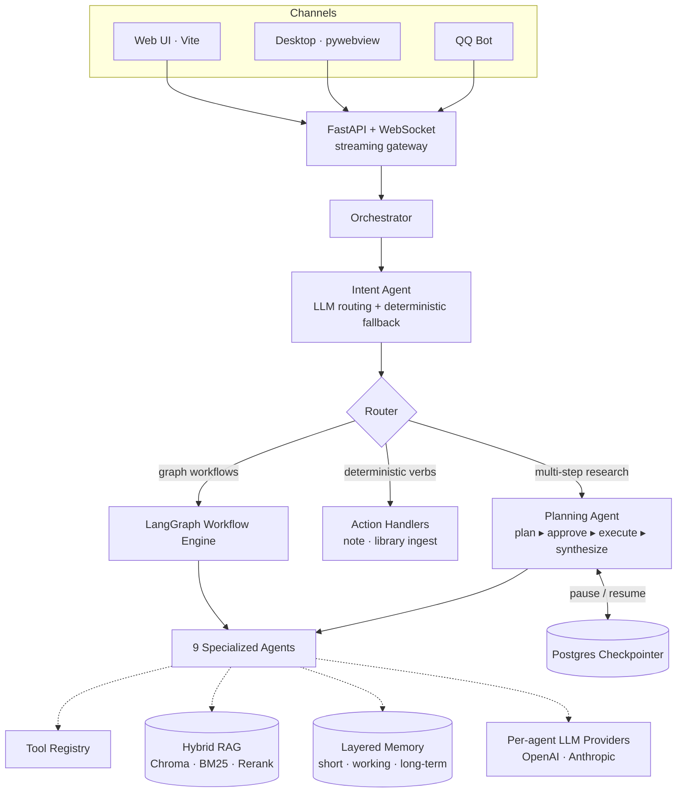

# 🔬 Research Agent — An Autonomous Multi-Agent Research Copilot

> A full-stack, multi-agent LLM system that searches literature, reads PDFs and web pages, reasons over a hybrid-retrieval knowledge base, writes academic prose, and plans multi-step research on its own — with human-in-the-loop control over what it does.

<p align="center">
  
  
  
  
  
  
</p>

> 🌏 中文版见 [README.zh-CN.md](README.zh-CN.md)

---

## ✨ Highlights

- 🧭 **Intent-driven multi-agent orchestration** — a dedicated *Intent Agent* routes every request, then an orchestrator dispatches one of **9 specialized agents** across **8 LangGraph workflows** (or a deterministic action handler).
- 🧠 **A planning agent that composes its own tools** — `plan → approve → execute → synthesize`, choosing and chaining tools (paper search, web fetch, notes…) at runtime instead of following a hard-coded script.
- 🙋 **Human-in-the-loop with durable checkpointing** — the planning graph can *pause* at a plan-approval checkpoint and *resume* later, with state persisted at every node boundary via a **Postgres-backed LangGraph checkpointer**.
- 🔎 **Hybrid-retrieval RAG** — dense vectors (Chroma) **+** BM25 keyword search **+** neural reranking (FlashRank), over both a long-term knowledge base and a per-session temporary store.
- 🗂️ **Layered memory** — short-term (with automatic conversation compression), working memory, and long-term user memory, threaded through every turn.
- 🧰 **A pluggable tool & LLM layer** — a central tool registry (paper search, PDF parsing, web scraping, image OCR+VLM, note CRUD) and **per-agent LLM providers** swappable between OpenAI and Anthropic.
- 🌐 **Full-stack & multi-channel** — async FastAPI backend with **streaming over WebSocket**, a Vite web UI, a `pywebview` desktop app, and a QQ bot — all behind one channel abstraction, with JWT auth.

---

## 🎬 Demo

> _Replace this with a short GIF of the agent answering a research question — it is the single highest-impact thing on the page._

```
┌──────────────────────────────────────────────────────────────┐
│  user ▸ 调研一下 RAG 在医疗领域的最新进展                        │
│                                                                │
│  ▸ intent ........ research_task                                │
│  ▸ plan .......... [paper_search] + [web_search] (2 steps)      │
│  ▸ approve ....... ✓ (auto / user-confirmed)                   │
│  ▸ execute ....... 12 papers · 6 pages fetched                 │
│  ▸ synthesize .... structured landscape + citations            │
└──────────────────────────────────────────────────────────────┘
```

---

## 🏗️ Architecture



---

## 🧠 Request Lifecycle

Every message flows through the same disciplined pipeline:

1. **Intent recognition** — the Intent Agent classifies the request into a *route* using session context, with a pure-keyword fallback if the LLM call fails.
2. **Routing** — the orchestrator resolves the route to one of three execution modes:
   - a **workflow** (a compiled LangGraph state machine),
   - a **deterministic action** (plain verbs like note CRUD / library ingest — no graph overhead),
   - or the **planning agent** for open-ended, multi-step research.
3. **Execution** — agents call tools, retrieve context, and stream progress events back over WebSocket.
4. **Memory & continuity** — outputs update short/working/long-term memory and session context, so follow-ups ("save that as a note", "expand this") resolve against the right task.

---

## 🔬 Engineering Deep-Dives

The parts that were genuinely hard — and the most interesting to talk through.

### 1. Two-tier routing: an LLM brain with a deterministic spine
Natural-language routing is delegated to the Intent Agent (it has session context, active entities, and recent output in its prompt), but **safety-critical and trivially-classifiable cases are handled deterministically** — explicit UI markers, task continuation, and a full keyword fallback. This avoids the classic failure mode where an LLM router silently mis-routes a user mid-task. Deterministic *verbs* (note CRUD, library ingest) bypass the graph engine entirely as **action handlers**, keeping hot paths fast and predictable.

### 2. A planning agent with real human-in-the-loop control
The research path is a 4-node LangGraph (`plan → approve → execute → synthesize`). The **approve** node is split from **plan** on purpose: LangGraph re-runs a node from its start on resume, and re-running the (expensive) planning LLM call would be wasteful — so the cheap approval gate is isolated. When enabled, it `interrupt()`s the graph, surfaces a plan card to the UI, and waits for the user to **approve / modify / cancel**, with an unattended-timeout default. State persists through a **Postgres checkpointer**, so a paused plan survives across requests.

### 3. Hybrid retrieval that doesn't rely on embeddings alone
Retrieval fuses **dense** (Chroma vector search), **sparse** (BM25 keyword), and **neural reranking** (FlashRank, with a CrossEncoder option). The system keeps a **long-term knowledge base** and a **per-session temporary store**, and decides between cached library context and fresh retrieval based on the query — so "this paper" follow-ups stay grounded in the right document.

### 4. Layered memory with automatic compression
Short-term memory holds recent turns and **compresses** itself once it grows past a threshold (older turns fold into a running summary); working memory carries per-task state; long-term memory captures durable user preferences. The Intent Agent and downstream agents all read from this so the system behaves coherently across a long session.

### 5. Pluggable tools & per-agent models
Tools are registered in a central **Tool Registry** with alias support, so a tool-calling agent can address `paper_search` / `web_fetch` / `note_create` by canonical name. Each agent can be wired to a **different LLM provider/model** (OpenAI or Anthropic), letting you put a cheap model on routing and a strong model on synthesis.

---

## 🤖 Agents

| Agent | Responsibility |
|-------|----------------|
| `intent_agent` | Classifies each request into a workflow / action / planning route |
| `research_agent` | Multi-step planning agent; composes tools autonomously (plan→execute→synthesize) |
| `literature_agent` | Searches, filters, and downloads papers (arXiv + Semantic Scholar) |
| `rag_agent` | Hybrid retrieval + grounded reading/QA over the knowledge base or uploads |
| `web_agent` | Web search → page fetch → synthesized answer |
| `writing_agent` | Academic writing from user input / uploads / library / any mix |
| `note_agent` | Create / update / delete / search / embed research notes |
| `summary_agent` | Conversation & session summarization |
| `general_agent` | Open-ended reasoning, planning, and chat fallback |

## 🔀 Workflows & Actions

**LangGraph workflows** (compiled state machines): `paper_search`, `question_answer`, `web_search`, `academic_writing`, `image_understanding`, `conversation_summary`, `research_agent`, `general_agent`.

**Deterministic actions** (direct handlers, no graph): `note_action`, `library_ingest_action`.

## 🧰 Tools

| Domain | Tools |
|--------|-------|
| Literature | paper search (arXiv, Semantic Scholar), semantic filter, PDF download |
| Documents | PDF/PPTX parsing (PyMuPDF + LlamaParse), chunking & indexing |
| Web | web search, page scrape, lightweight URL fetch |
| Vision | image understanding (OCR + VLM) |
| Knowledge | library add/search, RAG index & retrieval |
| Notes | full note CRUD + embedding |

---

## 🛠️ Tech Stack

| Layer | Technologies |
|-------|--------------|
| **Agents / Orchestration** | LangGraph, custom orchestrator & router, Pydantic schemas |
| **LLMs** | OpenAI + Anthropic (pluggable per agent) |
| **Retrieval** | Chroma (dense), `rank_bm25` (sparse), FlashRank (rerank), LangChain text splitters |
| **Documents** | PyMuPDF, python-pptx, LlamaIndex / LlamaParse |
| **Backend** | FastAPI, Uvicorn, async Python, WebSocket streaming |
| **Storage** | PostgreSQL (notes + LangGraph checkpointer), Chroma |
| **Frontend** | Vite SPA (ESM), `pywebview` desktop shell |
| **Channels** | Web, QQ bot (unified channel abstraction) |
| **Auth** | JWT, bcrypt, email verification (aiosmtplib) |

---

## 🚀 Quick Start

```bash
# 1. Install backend deps
pip install -r requirements.txt

# 2. Configure (copy and fill in API keys / DB url)
cp .env.example .env

# 3. Build the web frontend
cd web && npm install && npm run build && cd ..

# 4. Run
python web_server.py        # web app  → http://localhost:8000
# or
python desktop_app.py       # desktop app (pywebview)
```

> Requires Python 3.10+, Node 18+, and a PostgreSQL instance. See `.env.example` for the full configuration surface (LLM keys, per-agent models, DB, email, channels).

---

## 📂 Project Structure

```
app/
├── agents/        # 9 specialized agents (intent, research, rag, writing, …)
├── orchestrator/  # routing, action handlers, HITL checkpoint logic
├── workflows/     # LangGraph graph builders + registry
├── rag/           # long-term & temporary retrieval, reranker
├── memory/        # short-term / working / long-term memory
├── tools/         # tool registry: search, pdf, web, image, notes, library
├── channels/      # web + QQ channel adapters
├── services/      # LLM providers, note service, …
└── api/           # FastAPI server + WebSocket gateway
```

---

## 🗺️ Roadmap

- [ ] **Todo list & task board**: Add a persistent frontend workspace for tasks, with filtering, priority, due dates, status transitions, and links to sessions, notes, and papers.
- [ ] **MCP service**: Expose paper search, knowledge base, notes, files, calendar, and other capabilities as an MCP server so external clients and in-app agents can share one tool protocol.
- [ ] **Autonomous frontend workflow orchestration**: Add a visual workflow canvas/node editor where users can compose agents, tools, inputs, outputs, and approval checkpoints into reusable workflows.
- [ ] **Docker deployment**: Provide `Dockerfile`, `docker-compose.yml`, and dev/prod environment templates for FastAPI, Postgres, Chroma/vector storage, and frontend static assets.
- [ ] **Online web trial**: Deploy a public demo/trial site with guest mode, sample data, quota limits, auth, and data isolation.
- [ ] **Architecture rebuild**: Rework the boundaries between agents, workflows, tools, memory, channels, and storage; separate core packages from app wiring and define cleaner plugin extension points.
- [ ] Streaming token-level output from the planning agent
- [ ] Pluggable retrieval backends (Qdrant / pgvector)
- [ ] Evaluation harness for RAG faithfulness & answer relevancy
- [ ] React frontend migration

---

<p align="center"><sub>Built as a deep exploration of agentic LLM system design — orchestration, planning, retrieval, and memory.</sub></p>
