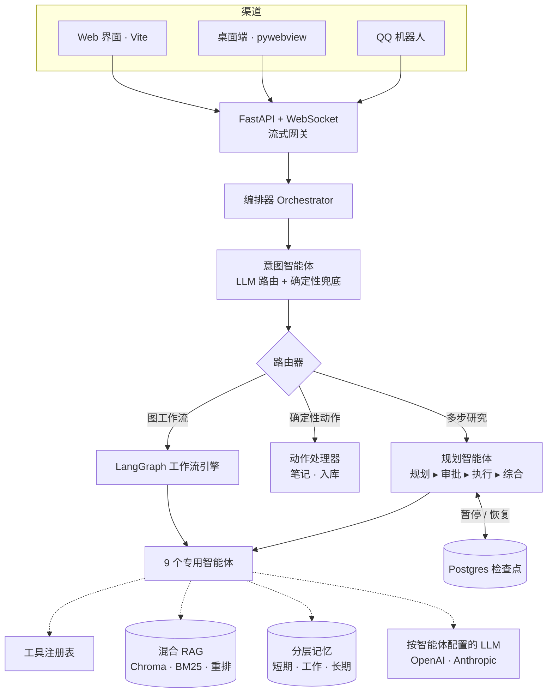

# 🔬 Research Agent — 自主多智能体科研副驾

> 一个全栈、多智能体的 LLM 系统:自动检索文献、阅读 PDF 与网页、在混合检索知识库上推理、撰写学术文本,并能自主规划多步研究——同时把"做什么"的控制权通过人在环交还给用户。

<p align="center">
  
  
  
  
  
  
</p>

> 🌏 English version: [README.md](README.md)

---

## ✨ 项目亮点

- 🧭 **意图驱动的多智能体编排** —— 专门的*意图智能体*为每个请求做路由,编排器再把任务分派给 **9 个专用智能体**、跑在 **8 条 LangGraph 工作流**上(或交给确定性动作处理器)。
- 🧠 **会自己组合工具的规划型智能体** —— `规划 → 审批 → 执行 → 综合`,在运行时自行选择并串联工具(论文检索、网页抓取、笔记……),而不是按写死的脚本走。
- 🙋 **带持久化检查点的人在环** —— 规划图可在"计划审批"处*暂停*、之后*恢复*,状态通过 **Postgres 版 LangGraph checkpointer** 在每个节点边界落盘。
- 🔎 **混合检索 RAG** —— 稠密向量(Chroma)**+** BM25 关键词 **+** 神经重排(FlashRank),覆盖长期知识库与会话级临时库。
- 🗂️ **分层记忆** —— 短期(带自动对话压缩)、工作记忆、长期用户记忆,贯穿每一轮对话。
- 🧰 **可插拔的工具与模型层** —— 中央工具注册表(论文检索、PDF 解析、网页抓取、图像 OCR+VLM、笔记 CRUD)+ **按智能体配置的 LLM**,在 OpenAI 与 Anthropic 之间自由切换。
- 🌐 **全栈 + 多渠道** —— 异步 FastAPI 后端 + **WebSocket 流式输出**,Vite Web 界面、`pywebview` 桌面端、QQ 机器人,统一在一套渠道抽象之下,并带 JWT 鉴权。

---

## 🎬 演示

> _在此放一段智能体回答科研问题的短 GIF —— 这是整页性价比最高的一处。_

```
┌──────────────────────────────────────────────────────────────┐
│  用户 ▸ 调研一下 RAG 在医疗领域的最新进展                        │
│                                                                │
│  ▸ 意图 .......... research_task                                │
│  ▸ 规划 .......... [paper_search] + [web_search]（2 步）        │
│  ▸ 审批 .......... ✓（自动 / 用户确认）                         │
│  ▸ 执行 .......... 12 篇论文 · 抓取 6 个页面                    │
│  ▸ 综合 .......... 结构化综述 + 引用                            │
└──────────────────────────────────────────────────────────────┘
```

---

## 🏗️ 系统架构



---

## 🧠 请求生命周期

每条消息都走同一条严谨的流水线:

1. **意图识别** —— 意图智能体结合会话上下文把请求分类到某个*路由*;若 LLM 调用失败,则退化为纯关键词兜底。
2. **路由分发** —— 编排器把路由解析为三种执行模式之一:
   - **工作流**(编译好的 LangGraph 状态机),
   - **确定性动作**(笔记 CRUD、入库等纯动词,无图开销),
   - 或面向开放式、多步研究的**规划智能体**。
3. **执行** —— 智能体调用工具、检索上下文,并通过 WebSocket 流式回传进度事件。
4. **记忆与连续性** —— 输出会更新短期/工作/长期记忆与会话上下文,因此"把刚才那个存成笔记""把这段扩写"这类追问能落到正确的任务上。

---

## 🔬 工程深挖

真正有难度、也最值得在面试里聊的几处。

### 1. 两层路由:LLM 大脑 + 确定性骨架
自然语言路由交给意图智能体(它的提示词里带会话上下文、活跃实体、最近输出),但**安全敏感与一眼可判的情况用确定性逻辑兜底** —— 显式 UI 标记、任务续接,以及完整的关键词兜底。这避免了 LLM 路由器在任务中途"悄悄走错路"的经典坑。确定性*动词*(笔记 CRUD、入库)作为**动作处理器**完全绕过图引擎,让热路径既快又可预测。

### 2. 带真正人在环控制的规划智能体
研究路径是一张 4 节点 LangGraph(`规划 → 审批 → 执行 → 综合`)。**审批**节点特意从**规划**中拆出:LangGraph 在恢复时会从节点起点重跑,重跑(昂贵的)规划 LLM 调用是浪费,因此把廉价的审批闸门单独隔离。开启后它会 `interrupt()` 暂停图、向前端推送计划卡片,等待用户**批准 / 修改 / 取消**,并带无人值守超时默认值。状态由 **Postgres checkpointer** 持久化,因此被暂停的计划能跨请求存活。

### 3. 不只靠向量的混合检索
检索融合了**稠密**(Chroma 向量)、**稀疏**(BM25 关键词)与**神经重排**(FlashRank,可选 CrossEncoder)。系统同时维护**长期知识库**与**会话级临时库**,并根据查询在"复用已缓存的库上下文"与"重新检索"之间做判断 —— 让"这篇论文"这类追问稳稳落在正确文档上。

### 4. 带自动压缩的分层记忆
短期记忆保存近期回合,并在超过阈值后**自我压缩**(更早的回合折叠进滚动摘要);工作记忆承载单任务状态;长期记忆沉淀稳定的用户偏好。意图智能体与下游智能体都读取这套记忆,使系统在长会话中行为连贯。

### 5. 可插拔工具与按智能体选型
工具注册在中央**工具注册表**里并支持别名,因此工具调用型智能体可用规范名直接寻址 `paper_search` / `web_fetch` / `note_create`。每个智能体都能挂**不同的 LLM 供应商/模型**(OpenAI 或 Anthropic) —— 路由用便宜模型、综合用强模型。

---

## 🤖 智能体

| 智能体 | 职责 |
|--------|------|
| `intent_agent` | 把每个请求分类到 工作流 / 动作 / 规划 路由 |
| `research_agent` | 多步规划智能体;自主组合工具(规划→执行→综合) |
| `literature_agent` | 检索、筛选、下载论文(arXiv + Semantic Scholar) |
| `rag_agent` | 在知识库或上传文件上做混合检索 + 有据可循的阅读问答 |
| `web_agent` | 网页搜索 → 抓取正文 → 综合作答 |
| `writing_agent` | 基于用户输入 / 上传 / 知识库 / 任意组合的学术写作 |
| `note_agent` | 笔记的创建 / 更新 / 删除 / 检索 / 向量化 |
| `summary_agent` | 对话与会话总结 |
| `general_agent` | 开放式推理、规划与对话兜底 |

## 🔀 工作流与动作

**LangGraph 工作流**(编译为状态机):`paper_search`、`question_answer`、`web_search`、`academic_writing`、`image_understanding`、`conversation_summary`、`research_agent`、`general_agent`。

**确定性动作**(直接处理器,无图):`note_action`、`library_ingest_action`。

## 🧰 工具

| 领域 | 工具 |
|------|------|
| 文献 | 论文检索(arXiv、Semantic Scholar)、语义筛选、PDF 下载 |
| 文档 | PDF/PPTX 解析(PyMuPDF + LlamaParse)、切块与索引 |
| 网页 | 网页搜索、正文抓取、轻量 URL 抓取 |
| 视觉 | 图像理解(OCR + VLM) |
| 知识 | 知识库增/查、RAG 索引与检索 |
| 笔记 | 完整笔记 CRUD + 向量化 |

---

## 🛠️ 技术栈

| 层 | 技术 |
|----|------|
| **智能体 / 编排** | LangGraph、自研编排器与路由器、Pydantic schema |
| **大模型** | OpenAI + Anthropic(按智能体可插拔) |
| **检索** | Chroma(稠密)、`rank_bm25`(稀疏)、FlashRank(重排)、LangChain text splitters |
| **文档** | PyMuPDF、python-pptx、LlamaIndex / LlamaParse |
| **后端** | FastAPI、Uvicorn、异步 Python、WebSocket 流式 |
| **存储** | PostgreSQL(笔记 + LangGraph 检查点)、Chroma |
| **前端** | Vite SPA(ESM)、`pywebview` 桌面壳 |
| **渠道** | Web、QQ 机器人(统一渠道抽象) |
| **鉴权** | JWT、bcrypt、邮箱验证(aiosmtplib) |

---

## 🚀 快速开始

```bash
# 1. 安装后端依赖
pip install -r requirements.txt

# 2. 配置(复制后填入 API key / 数据库地址)
cp .env.example .env

# 3. 构建 Web 前端
cd web && npm install && npm run build && cd ..

# 4. 运行
python web_server.py        # Web 应用 → http://localhost:8000
# 或
python desktop_app.py       # 桌面端（pywebview）
```

> 需要 Python 3.10+、Node 18+ 与一个 PostgreSQL 实例。完整配置项见 `.env.example`(LLM 密钥、各智能体模型、数据库、邮件、渠道)。

---

## 📂 项目结构

```
app/
├── agents/        # 9 个专用智能体（intent、research、rag、writing…）
├── orchestrator/  # 路由、动作处理器、人在环检查点逻辑
├── workflows/     # LangGraph 图构造器 + 注册表
├── rag/           # 长期 & 临时检索、重排
├── memory/        # 短期 / 工作 / 长期记忆
├── tools/         # 工具注册表:检索、pdf、网页、图像、笔记、知识库
├── channels/      # web + QQ 渠道适配
├── services/      # LLM 供应商、笔记服务…
└── api/           # FastAPI 服务 + WebSocket 网关
```

---

## 🗺️ 路线图

- [ ] **待做清单与任务看板**: 在前端增加可保存、可筛选、可关联会话/笔记/论文的 Todo 工作区,支持优先级、截止日期、状态流转与智能拆解。
- [ ] **MCP 服务**: 将论文检索、知识库、笔记、文件、日程等能力暴露为 MCP server,让外部客户端和本项目智能体共享同一套工具协议。
- [ ] **前端工作流自主编排**: 在 Web 端提供可视化工作流画布/节点编辑器,让用户选择工具、智能体、输入输出和审批点,并保存为可复用流程。
- [ ] **Docker 部署**: 提供 `Dockerfile`、`docker-compose.yml` 与生产/开发环境变量模板,一键启动 FastAPI、Postgres、Chroma/向量库和前端静态资源。
- [ ] **在线网页试用**: 部署公开 Demo/试用站点,支持游客模式、示例数据、额度限制、登录注册和安全隔离。
- [ ] **架构重建**: 梳理 agent、workflow、tool、memory、channel、storage 的边界,拆分核心包与应用层,减少循环依赖并建立更清晰的插件化扩展点。
- [ ] 规划智能体的 token 级流式输出
- [ ] 可插拔检索后端(Qdrant / pgvector)
- [ ] RAG 忠实度与答案相关性评测框架
- [ ] React 前端迁移

---

<p align="center"><sub>作为对「智能体式 LLM 系统设计」的深度探索而构建 —— 编排、规划、检索与记忆。</sub></p>
